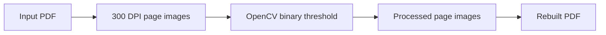

# PDF Watermark Remover

A small batch-processing tool that removes light, image-based watermarks from PDFs by
rasterizing each page, applying a binary threshold, and rebuilding the document.

> Use this only on documents you own or have permission to modify. Removing attribution,
> ownership marks, or access controls from someone else's material may violate copyright,
> contract terms, or applicable law.

## How it works

For every PDF in `pdf_data/`, the script:

1. Converts each page to a 300 DPI PNG with Poppler.
2. Applies OpenCV binary thresholding at a value of `150`.
3. Saves the original and processed page images under `temp_images/`.
4. Reassembles the processed pages as `clean_pdf_data/cleaned_<original-name>.pdf`.



This approach works best when the document has dark text on a light background and the
watermark is lighter than the main content.

## Requirements

- Python 3
- Poppler

Install Poppler on macOS:

```bash
brew install poppler
```

On Ubuntu or Debian:

```bash
sudo apt-get install poppler-utils
```

Windows users can install a Poppler build and add its `bin` directory to `PATH`.

## Setup

```bash
git clone https://github.com/sakshii-shinde/watermark_removee.git
cd watermark_removee

python3 -m venv .venv
source .venv/bin/activate
pip install -r requirements.txt

mkdir pdf_data
```

On Windows, activate the virtual environment with:

```powershell
.venv\Scripts\activate
```

## Usage

Put one or more PDFs in `pdf_data/`, then run:

```bash
python watermark_remove.py
```

The script processes every `.pdf` file in that directory and reports how many succeeded
or failed. Results are written to `clean_pdf_data/`; intermediate PNG files remain in
`temp_images/` for inspection.

```text
watermark_removee/
├── pdf_data/          # Input PDFs
├── clean_pdf_data/    # Rebuilt PDFs
└── temp_images/       # Original and processed page images
```

## Limitations

- This is thresholding, not watermark detection or inpainting. It processes the entire
  page uniformly.
- It can remove light text, photographs, colors, shading, and other page detail along
  with the watermark.
- Every page is rasterized, so selectable text, links, forms, annotations, and other PDF
  structure are not preserved.
- The threshold is fixed at `150`; documents with different contrast may need a code
  change.
- Rasterizing at 300 DPI can use substantial disk space and memory on large PDFs.

Always inspect the rebuilt PDF before replacing an original file.

## Dependencies

| Package | Purpose |
| --- | --- |
| `pdf2image` | Render PDF pages through Poppler |
| `opencv-python` | Apply binary thresholding |
| `Pillow` | Rebuild processed pages as a PDF |
| `numpy` | OpenCV array operations |

## Status

Personal utility. The current version uses a fixed threshold and a folder-based batch
workflow.
